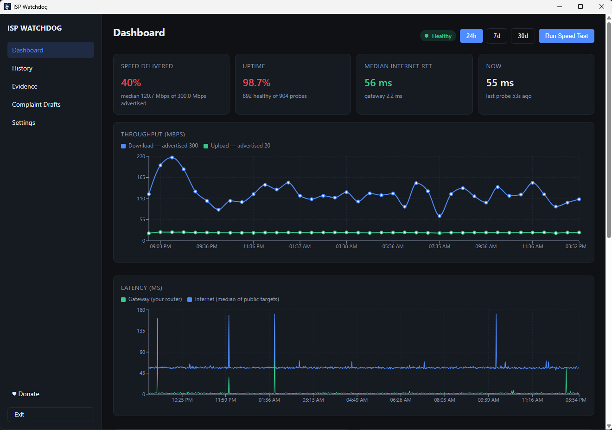
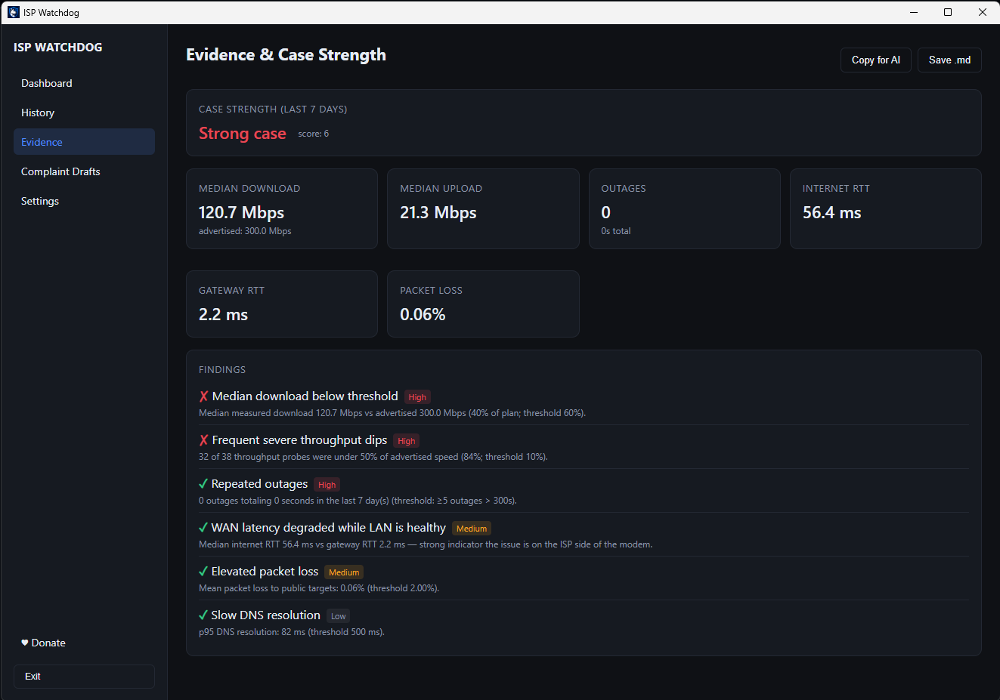
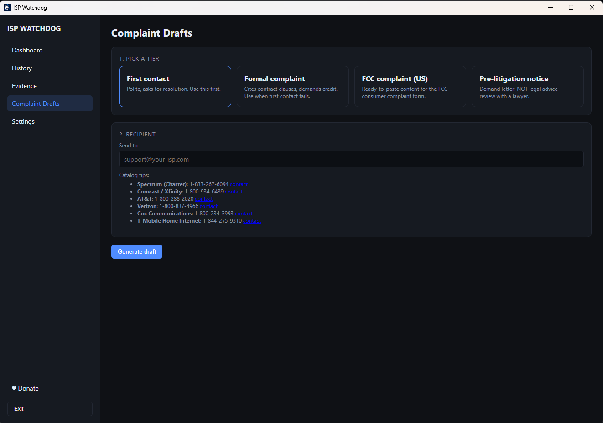

# ISP Watchdog

> A free, open-source desktop app that quietly measures your internet connection,
> proves the problem is on the ISP's side of your router, and builds the case
> for a refund or service credit.

ISPs sell "up to" speeds and bet that nobody bothers to measure. ISP Watchdog
flips that asymmetry: it sits in your system tray, takes continuous measurements
of latency, packet loss, DNS, and throughput, stores everything locally, and
when the evidence is strong enough, drafts a complaint email — polite at first,
firmer over time, all the way to an FCC filing — pre-filled with your data.

**No accounts. No telemetry. Everything stays on your machine.**

---

## See it in action

### 1. Catch the problem

The dashboard shows your real delivered speeds vs. what you're paying for — in real time and over 24h / 7d / 30d windows. When your ISP is underdelivering, it's immediately obvious.



> *Example: paying for 300 Mbps, consistently getting 40%. The gateway RTT is 2 ms — your router is fine. The WAN isn't.*

---

### 2. Build an airtight case

The Evidence page scores your case across six criteria — throughput, latency, packet loss, DNS, outages, and the LAN-vs-WAN comparison. Each finding is explained in plain English with the exact numbers, so you know exactly what to say.



> *"Strong case, score 6" — 84% of probes were below 50% of advertised speed. That's a complaint worth sending.*

---

### 3. Send the complaint

Pick your escalation tier — start polite, go firm if they ignore you, file with the FCC if it keeps happening. ISP contact info is built in. Click **Generate draft** and it opens pre-filled in your email client. You review before anything sends.



> *Four tiers: friendly first contact → formal complaint → FCC filing → pre-litigation notice.*

---

## Features

- **Continuous background probes** — latency/DNS/packet-loss every ~60 s, throughput every ~30 min against Cloudflare's open speed-test endpoint.
- **Local SQLite storage** — portable, inspectable with any SQLite tool, never leaves your machine.
- **System tray** — green / amber / red / grey health indicator. Click to open; right-click to pause, run a speed test, or quit.
- **Rich dashboard** — throughput, latency, packet loss, DNS, health distribution, and hour-of-day patterns over 24h / 7d / 30d windows.
- **Case-strength scoring** — five tiers (None → Weak → Moderate → Strong → Regulatory-Ready) based on configurable thresholds.
- **Escalating email drafts** — four tiers (polite request → formal complaint → FCC complaint → legal notice), opened in your default mail client via `mailto:`. You always review before sending.
- **ISP catalog** — quick contact info for Spectrum, Comcast/Xfinity, AT&T, Verizon, Cox, T-Mobile Home Internet, and a generic fallback.
- **FCC complaint workflow** — unlocked once your case reaches "Strong".
- **Equipment registry** — log your modem/router to pre-empt the ISP's "blame your hardware" deflection.
- **AI export** — one-click markdown report you can paste into any AI assistant (Claude, ChatGPT, etc.) for case analysis.

## Why "it's not my WiFi"

Every probe pings your local gateway *and* the public internet. If gateway RTT
stays <5 ms while internet RTT climbs past 100 ms, the case writes itself: your
LAN is fine, the WAN isn't. That's the single most useful piece of evidence you
can present to support — or to a regulator.

---

## Install (Windows)

Download the latest installer from the [Releases](../../releases) page:

- `ISP_Watchdog_x.x.x_x64-setup.exe` — standard Windows installer (recommended)
- `ISP_Watchdog_x.x.x_x64_en-US.msi` — MSI for managed deployments

> **Builds are unsigned in alpha.** On first launch Windows SmartScreen will
> warn you. Click **More info → Run anyway**. The source is fully auditable here.

## Install (macOS)

Download the `.dmg` from the latest release. Drag *ISP Watchdog* to *Applications*.

First launch: **right-click → Open**, then confirm. Or in Terminal:

```bash
xattr -d com.apple.quarantine /Applications/ISP\ Watchdog.app
```

---

## Build from source

**Prerequisites:** Node 20+, Rust 1.77+, and on Windows the **MSVC C++ Build Tools**
("Desktop development with C++" workload in Visual Studio Installer).

```bash
# one-time setup (Windows)
winget install --id Rustlang.Rustup -e
winget install --id Microsoft.VisualStudio.2022.BuildTools -e

# clone and run
git clone https://github.com/cperos-xr/isp-watchdog.git
cd isp-watchdog
npm install
npm run tauri:dev        # development (hot-reload)
npm run tauri:build      # production installer
```

---

## Configure your plan

Open the app → **Settings**.

1. Pick your ISP and enter your plan name + advertised speeds.
2. Enter your name and account number — these appear in email drafts.
3. (Optional) Add modem/router details under **Equipment** to counter hardware-blame deflection.
4. (Optional) Tune the evidence thresholds. Defaults are conservative; tighten them if your ISP promises an SLA.
5. (Optional) Enable **Launch on startup** so the app keeps probing after a reboot.

---

## Using the AI export

On the **Evidence** page, click **Copy for AI** or **Save .md** to get a
structured markdown snapshot of your case — all stats, findings, and scores in
one document. Paste it into Claude, ChatGPT, or any other assistant and ask it
to help you write a complaint, check your case strength, or suggest next steps.

The saved file lands in your **Documents** folder as `isp-watchdog-YYYY-MM-DD.md`.

### Optional: Pollinations (bring your own Pollen)

ISP Watchdog can call Pollinations to generate summaries or draft complaint letters directly from the app. To enable it, open **Settings → AI Integrations**, paste your Pollinations secret key (starts with `sk_...`) or complete the App Key device flow, then save. The app only uses authenticated Pollinations routes: private text generation plus account balance / usage endpoints so it can show remaining Pollen, recent usage, and a rough per-request estimate before you run an AI action.

The default in-app text model is `gpt-5.4-mini`, and you can override it in **Settings** if you want a different Pollinations text model. See https://enter.pollinations.ai for account keys and BYOP instructions.
---

## Privacy

Everything stays on your machine:

| What | Where |
|---|---|
| Database | `%APPDATA%\org.ispwatchdog.app\data.db` (Win) |
| Database | `~/Library/Application Support/org.ispwatchdog.app/data.db` (Mac) |

Probes target Cloudflare's open endpoints (`1.1.1.1`, `speed.cloudflare.com`) and your own gateway. No accounts, no remote logging, no analytics.

---

## Roadmap

- **v0.2** — AI integration: bring-your-own OpenAI-compatible key (OpenAI, Groq, OpenRouter, **local Ollama / LM Studio**) for contract analysis and case narrative generation.
- **v0.3** — Contract upload (PDF/HTML) + ISP-terms auto-fetch with AI extraction of advertised speeds, SLA, and refund clauses.
- **v0.4** — Opt-in SMTP auto-send with 24 h confirmation timer, password in OS keyring.
- **v0.5** — Code signing (Windows) + Apple notarization.
- **v0.x** — Linux build, EU/UK ISP catalog and Ofcom workflow.

---

## Contributing

PRs welcome. Most useful contributions:

- Adding ISPs to [`src-tauri/src/contracts/mod.rs`](src-tauri/src/contracts/mod.rs)
- Refining email templates in [`templates/`](templates/)
- Improving threshold defaults for your country / market

Open an issue before anything larger than a localized tweak.

---

## Support the project

ISP Watchdog is free and always will be. If it helped you claw back a credit,
consider buying me a coffee:

- [Buy Me a Coffee](https://buymeacoffee.com/cperos) — card, Apple Pay, Google Pay
- [Venmo](https://venmo.com/u/Constantine-Peros) — @Constantine-Peros

Crypto addresses coming soon.

---

## Disclaimer

The "legal notice" template is a draft produced by software. **It is not legal
advice.** Before sending it, have a qualified attorney in your jurisdiction
review it. The maintainers accept no liability for outcomes.

## License

MIT — see [LICENSE](LICENSE).
